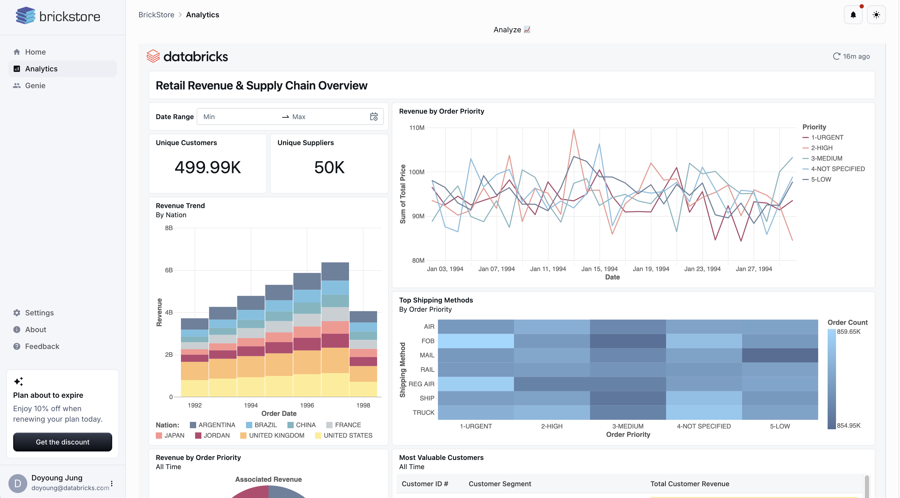
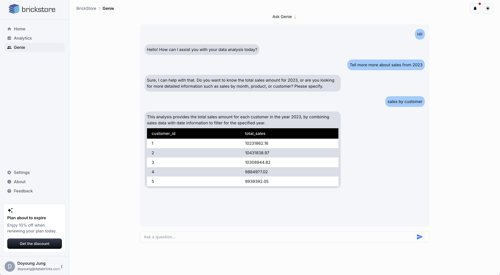

# Embedded Analytics with Databricks AI/BI

## :bulb: Demo Overview

This demo showcases how to embed Databricks AI/BI Dashboards and Genie into your application, providing users with real-time insights without leaving your platform. 

For this demo, let's imagine a fictional company called Brickstore, where brick suppliers sell bricks to customers on the Brickstore web platform. Brickstore embeds AI/BI dashboards and Genie into their platform, allowing users to analyze sales data without having to leave to another site!

:no_good: Disclaimer: Please read the following before proceeding.
1. This demo uses Databricks Apps for simplicity but can be deployed on any modern web server.
2. This application is for demonstration purposes only; consider adding security measures and error handling for production use.
3. This repo is not meant to be a "click-and-deploy" solution. Instead, use the code in this repo as reference as you build your own embedded analytics application.

## :star2: AI/BI Embedding

AI/BI features two complementary capabilities: Dashboards and Genie. Dashboards provide a low-code experience to help analysts quickly build highly interactive data visualizations for their business teams using natural language, and Genie allows business users to converse with their data to ask questions and self-serve their own analytics. Both of these capabilites can be embedded into external applications.

### 1. Dashboard Embedding

With dashboard embedding, you are able to seamlessly embed a dashboard into your application as you can see in the example above. There are two different ways you can embed dashbaords with AI/BI.

**Option 1: iframe embedding (a.k.a Copy Embed Code)**

- Generally Available!
- This is the simplest way to embed an AI/BI dashboard (see [here](https://docs.databricks.com/en/dashboards/embed.html#embed-a-dashboard) for instructions).
- Best-suited for internal use cases
    - Users are already Databricks users in your account
    - Low-code/No-code approach, but comes with limitations (ex: users need to sign-in to Databricks to see dashboard)
- Not showcased in this demo

**Option 2: Token-Based Embedding (a.k.a App-Delegated Authentication Embedding)**

- Private Preview as of March 2025 (reach out to your Databricks Account Team)
- Best-suited for external use cases
    - Users are not Databricks users in your account (i.e. your end-customers)
    - More complex, requires backend and frontend implementation via code
    - Allows passing parameters for Row-Level Security (RLS).
- For sample code, refer to:
    - **app.py**
    - backend/**dashboard_embedding.py**
    - frontend/src/pages/**Analytics.js**

#### Dashboard Embedding Architecture Diagram

### 2. Genie Embedding

Before Genie Conversational APIs became available, you could only interact with Genie through the Databricks UI. Now, you are able to use Genie Conversational APIs to build your own version of Genie in your own application as you can see above.

**Genie Conversational APIs**

- Public Preview as of March 2025
- Surfaces AI/BI Genie through a REST endpoint
- For sample code, refer to:
    - **app.py**
    - backend/**genie_embedding.py**
    - frontend/src/pages/**Genie.js**
    - frontend/src/components/**ChatMessage.js**

#### API Flow

#### Genie Embedding Architecture Diagram

## :rocket: Learn More

- AI/BI
    -  [Databricks AI/BI Product Page](https://www.databricks.com/product/ai-bi)
- Dashboard Embedding
    - [iframe Embedding Documentation](https://docs.databricks.com/aws/en/dashboards/embed)

- Genie Conversational APIs
    - [Genie API Documentation](https://docs.databricks.com/api/workspace/genie)
    - [Genie API Blog](https://www.databricks.com/blog/genie-conversation-apis-public-preview)

## :closed_lock_with_key: License

&copy; 2025 Databricks, Inc. All rights reserved. The source in this project is provided subject to the Databricks License [https://databricks.com/db-license-source].  All included or referenced third party libraries are subject to the licenses set forth below.

| library | description | license | source |
|----------------------------------------|-------------------------|------------|-----------------------------------------------------|
| **Flask** | Lightweight WSGI web application framework | BSD 3-Clause | https://github.com/pallets/flask |
| **Flask-SQLAlchemy** | Extension for Flask that adds support for SQLAlchemy | MIT | https://github.com/pallets/flask-sqlalchemy |
| **requests** | Library for making HTTP requests | Apache 2.0 | https://github.com/psf/requests |
| **pandas** | Library for data manipulation and analysis | BSD 3-Clause | https://github.com/pandas-dev/pandas |
| **Flask-JWT-Extended** | Extension for handling JSON Web Tokens in Flask | MIT | https://github.com/vimalloc/flask-jwt-extended |
| **Flask-CORS** | Extension for handling Cross-Origin Resource Sharing in Flask | MIT | https://github.com/corydolphin/flask-cors |
| **python-dotenv** | Library for loading environment variables from .env files | MIT | https://github.com/theskumar/python-dotenv |
| **axios** | Promise based HTTP client for the browser and node.js | MIT | https://github.com/axios/axios |
| **@emotion/react** | Library for building robust, customizable, and performant UI components with React | MIT | https://github.com/emotion-js/emotion |
| **@emotion/styled** | Library for building robust, customizable, and performant UI components with React | MIT | https://github.com/emotion-js/emotion |
| **@fontsource/roboto** | Font package for Roboto | Apache-2.0 | https://github.com/fontsource/fontsource |
| **@mui/icons-material** | Material Design icons for React | MIT | https://github.com/mui-org/material-ui |
| **@mui/material** | Material Design components for React | MIT | https://github.com/mui-org/material-ui |
| **react** | JavaScript library for building user interfaces | MIT | https://github.com/facebook/react |
| **react-dom** | React package for working with the DOM | MIT | https://github.com/facebook/react |
| **react-router-dom** | DOM bindings for React Router | MIT | https://github.com/remix-run/react-router |
| **react-scripts** | Scripts and configuration used by Create React App | MIT | https://github.com/facebook/create-react-app |
| **cra-template** | Template for Create React App | MIT | https://github.com/facebook/create-react-app |
| **@databricks/aibi-client** | Databricks AI & BI Client | MIT | https://github.com/databricks/aibi-client |
---

Databricks support doesn't cover this content. For questions or bugs, please open a github issue and the team will help on a best effort basis.
