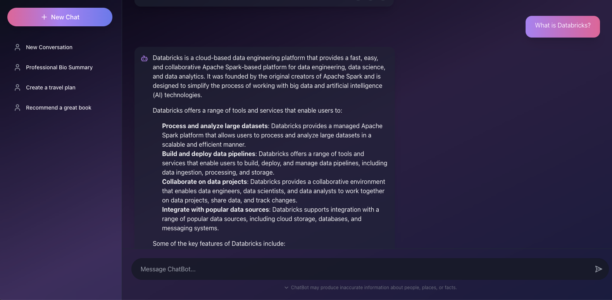
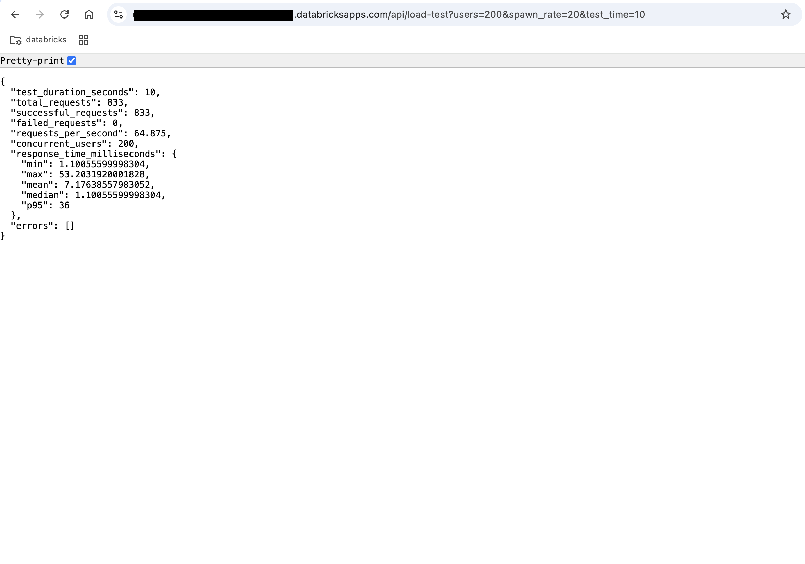

# AI Chat Application with Load Testing


*AI Chat Interface with real-time responses*

## Overview
This app is a full-stack application featuring a chat interface powered by LLM, built with React and FastAPI. It includes a load testing capability to evaluate performance under various conditions.

### Key Features
- 🤖 AI-powered chat interface
- 🎨 Modern UI with Tailwind CSS
- 📊 Built-in load testing capabilities
- 🔄 Real-time response handling
- 🌐 FastAPI backend with async support

## Prerequisites
- Python 3.8+
- Node.js 18.x+
- npm or yarn
- A Databricks workspace (for AI model serving)

## Environment Setup

1. Clone the repository:

```bash
git clone <repository-url>
```

2. Create and activate a Python virtual environment:

```bash
python -m venv venv
source venv/bin/activate  # On Windows: .\venv\Scripts\activate
```

3. Install Python dependencies:

```bash
pip install -r requirements.txt
```

## Building the Frontend

1. Navigate to the client directory:

```bash
cd client
```

2. Install dependencies:

```bash
npm install
```

3. Build the production version:

```bash
npm run build
```

## Running the Application

1. For development with hot-reload:

```bash
# Terminal 1 - Frontend
cd client
npm start

# Terminal 2 - Backend
hypercorn app:app --bind 127.0.0.1:8000
```

2. For production:

```bash
hypercorn app:app --bind 127.0.0.1:8000
```

3. For Databricks Apps deployment:

   a. Install the Databricks CLI:
   ```bash
   brew install databricks
   ```

   b. Create the app in your workspace:
   ```bash
   databricks apps create chat-app
   ```


    c. Create an `app.yaml` file in the root directory:

    ```yaml
    command:
    - "hypercorn"
    - "app:app"
    - "--bind"
    - "127.0.0.1:8000"

    env:
    - name: "SERVING_ENDPOINT_NAME"
        valueFrom: "serving_endpoint"
    ```

    The `app.yaml` configuration uses Hypercorn as the ASGI server to run your FastAPI application. 
    The environment section defines `SERVING_ENDPOINT_NAME` which is configured (`serving_endpoint`) through apps creation in Databricks, securly storing and accessing sensitive values.

    For detials on how to create an app in Databricks, please refer to the [Databricks Apps Documentation](https://docs.databricks.com/en/dev-tools/databricks-apps/configuration.html).


   d. Sync your local files to Databricks workspace:
   ```bash
   # Add node_modules/ and venv/ to .gitignore first if not already present
   databricks sync --watch . /Workspace/Users/<your-email>/chat-app
   ```

   e. Deploy the app:
   ```bash
   databricks apps deploy chat-app --source-code-path /Workspace/Users/<your-email>/chat-app
   ```

   The application will be available at your Databricks Apps URL:
   - Production URL: https://chat-app-[id].cloud.databricksapps.com


The application includes built-in load testing capabilities. 
To run a load test:

### Local App Testing
```bash
curl "http://localhost:8000/api/load-test?users=200&spawn_rate=2&test_time=10"
```

### Databricks Deployed App Testing

*Run load tests in the Databricks Apps UI*

Parameters:
- `users`: Number of concurrent users (default: 10)
- `spawn_rate`: Users to spawn per second (default: 2)
- `test_time`: Duration of test in seconds (default: 30)

### Load Testing Best Practices

1. **Gradual Scaling**
   - Start with smaller numbers and gradually increase
   - Monitor system performance metrics
   - Watch for error rates and response times

2. **Production Testing**
   - Schedule load tests during off-peak hours
   - Alert relevant team members before large-scale tests
   - Monitor application logs and metrics during tests


3. **Testing Scenarios**
 
   # Light load test
   https://chat-app-[id].cloud.databricksapps.com/api/load-test?users=200&spawn_rate=10&test_time=30

   # Medium load test
   https://chat-app-[id].cloud.databricksapps.com/api/load-test?users=1000&spawn_rate=100&test_time=30

   # Heavy load test
    https://chat-app-[id].cloud.databricksapps.com/api/load-test?users=10000&spawn_rate=1000&test_time=30
   

## Project Structure

```
chatbot-app/
├── app.py              # FastAPI backend application
├── load_tester.py      # Load testing endpoint
├── requirements.txt    # Python dependencies
├── client/            # React frontend
│   ├── src/          # Source code
│   ├── public/       # Static assets
│   ├── build/        # # Static frontend files
│   └── package.json  # Node.js dependencies
└── .env              # Environment variables
```

## API Endpoints

- `GET /api/`: Health check endpoint
- `POST /api/chat`: Chat endpoint for AI interactions
- `GET /api/load-test`: Load testing endpoint

## Contributing

1. Fork the repository
2. Create your feature branch (`git checkout -b feature/amazing-feature`)
3. Commit your changes (`git commit -m 'Add some amazing feature'`)
4. Push to the branch (`git push origin feature/amazing-feature`)
5. Open a Pull Request

