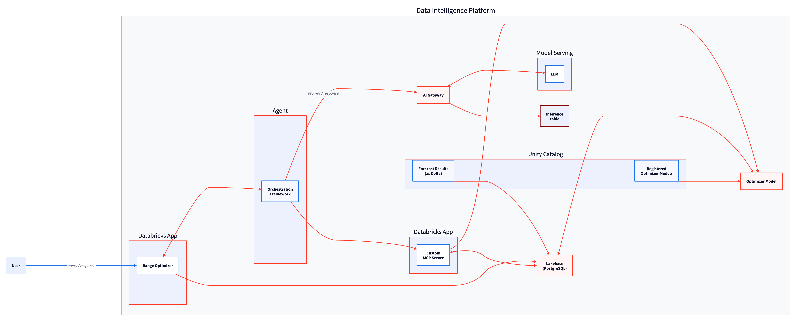
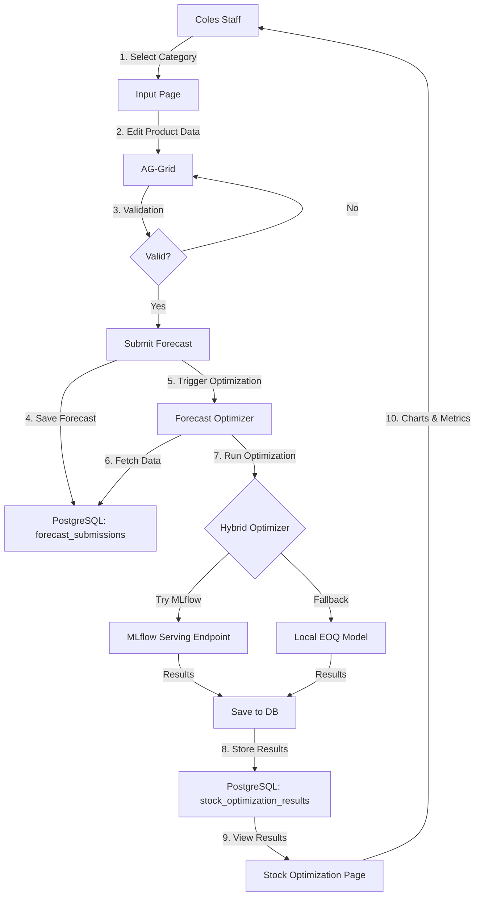

# Coles Inventory Intelligence - System Architecture

## Overview

Coles Inventory Intelligence is a comprehensive forecasting and stock optimization platform built on Databricks infrastructure. The system enables Coles staff to submit category-based forecast runs and automatically generate optimal inventory recommendations using ML-powered Economic Order Quantity (EOQ) optimization.



## Architecture Layers

### 1. **Frontend Layer**

#### **Dash Plotly Web Application**
- Multi-page Python web application
- Server-side rendering with reactive callbacks
- Built with Flask under the hood
- Responsive design that works on desktop and mobile

#### **Dash Mantine Components (DMC)**
- Modern, accessible UI component library
- Coles-branded color scheme (#E21837 primary red)
- Components: Cards, Buttons, Selects, Alerts, Navigation
- Consistent design language across all pages

#### **AG-Grid (Excel-like Interface)**
- Professional data grid component
- Real-time validation and editing
- Duplicate detection and required field checking
- Column filtering, sorting, and pagination
- CSV import/export capabilities

### 2. **Application Layer**

#### **Pages**
Three main pages provide the user interface:

- **Home/Input Page** (`pages/home.py`)
  - Category selection (Beverages, Dairy, Bakery, Snacks, Frozen)
  - Product data grid with Excel-like editing
  - Real-time validation feedback
  - Forecast submission workflow

- **Stock Optimization Page** (`pages/stock_optimization.py`)
  - Forecast run selector dropdown
  - Summary metrics cards (total products, stock levels, costs, revenue, profit)
  - Interactive Plotly charts (stock levels, cost vs revenue, turnover, profit)
  - Detailed results grid with CSV export

- **About Page** (`pages/about.py`)
  - System overview and architecture diagram
  - Key features and technology stack
  - How-to guide and workflow explanation

#### **Callbacks**
Dash callbacks handle user interactions and state management:

- **Input Callbacks** (`callbacks/input_callbacks.py`)
  - Category selection and data loading
  - Grid editing and validation
  - Forecast submission and database insertion
  - Automatic optimization trigger on submit

- **Stock Optimization Callbacks** (`callbacks/stock_optimization_callbacks.py`)
  - Forecast dropdown population
  - Results loading and filtering by forecast ID
  - Summary statistics calculation
  - Chart data preparation and rendering
  - CSV export functionality

#### **Components**
Reusable UI components:

- **Input Grid** (`components/input.py`)
  - AG-Grid configuration with validation rules
  - Button controls (Submit, Reset, Upload, Download, Delete)
  - Category dropdown and data filtering

- **Stock Optimization** (`components/stock_optimization.py`)
  - Summary cards with formatted metrics
  - Multi-chart Plotly visualizations
  - Results grid with column definitions

### 3. **ML Layer**

#### **Hybrid Stock Optimizer** (`ml/mlflow_client.py`)
Intelligent fallback system for optimization:

```python
class HybridStockOptimizer:
    def optimize(self, forecast_data):
        try:
            # 1. Try MLflow Model Serving endpoint first (production)
            result_df = mlflow_client.predict(forecast_data)
            return result_df, "mlflow"
        except Exception:
            # 2. Fall back to local EOQ model (development/offline)
            result_df = FallbackOptimizer.optimize(forecast_data)
            return result_df, "fallback"
```

**Benefits:**
- Production: Uses scalable MLflow Model Serving endpoints
- Development: Works offline with local EOQ implementation
- Resilience: Automatic fallback ensures continuous operation
- Transparency: Tracks which method was used for each optimization

#### **Local EOQ Optimizer** (`ml/stock_optimizer.py`)
Traditional inventory optimization model:

**Calculations:**
1. **Economic Order Quantity (EOQ)**
   ```
   EOQ = √(2 × Annual Demand × Ordering Cost / (Holding Cost Rate × Unit Cost))
   ```

2. **Safety Stock**
   ```
   Safety Stock = Z-Score × Demand Std Dev × √Lead Time
   ```

3. **Reorder Point**
   ```
   Reorder Point = (Avg Daily Demand × Lead Time) + Safety Stock
   ```

4. **Max Stock Level**
   ```
   Max Stock Level = Reorder Point + EOQ
   ```

5. **Financial Metrics**
   - Annual ordering cost
   - Annual holding cost
   - Total annual cost
   - Expected annual revenue
   - Expected annual profit
   - Inventory turnover rate

#### **Forecast Optimizer Module** (`ml/forecast_optimizer.py`)
Integration layer that connects forecast submissions to optimization:

**Workflow:**
1. Fetch forecast submission data by forecast_id
2. Transform data into optimization input format
3. Generate demand forecasts based on product attributes
4. Run hybrid optimization (MLflow or fallback)
5. Add metadata (forecast_id, timestamp, method)
6. Convert column names to lowercase for PostgreSQL
7. Save results to database

### 4. **Data Layer**

#### **Databricks Lakebase PostgreSQL**
Managed PostgreSQL service with enterprise features:

- **Host**: `instance-*.database.azuredatabricks.net`
- **Port**: 5432
- **Database**: `databricks_postgres`
- **Schema**: `excel_app`
- **SSL Mode**: Required
- **Authentication**: OAuth 2.0 via Databricks Workspace Client

#### **Database Tables**

**1. layout_data**
Stores product master data (20 products across 5 categories):
```sql
CREATE TABLE excel_app.layout_data (
    SELL_ID VARCHAR(50) PRIMARY KEY,
    CATEGORY_NAME VARCHAR(100),
    SUBCATEGORY_NAME VARCHAR(100),
    PRODUCT_NAME VARCHAR(200),
    SHELF_SPACE_CM FLOAT,
    SHELF_HEIGHT_CM FLOAT,
    MIN_STOCK INT,
    MAX_STOCK INT
)
```

**2. forecast_submissions**
Stores submitted forecast runs:
```sql
CREATE TABLE excel_app.forecast_submissions (
    FORECAST_ID VARCHAR(100) NOT NULL,
    SELL_ID VARCHAR(50) NOT NULL,
    CATEGORY_NAME VARCHAR(100),
    SUBCATEGORY_NAME VARCHAR(100),
    PRODUCT_NAME VARCHAR(200),
    SHELF_SPACE_CM FLOAT,
    SHELF_HEIGHT_CM FLOAT,
    MIN_STOCK INT,
    MAX_STOCK INT,
    SUBMISSION_TIMESTAMP TIMESTAMP,
    PRIMARY KEY (FORECAST_ID, SELL_ID)
)
```

**3. stock_optimization_results**
Stores optimization outputs:
```sql
CREATE TABLE excel_app.stock_optimization_results (
    forecast_id VARCHAR(100) NOT NULL,
    sell_id VARCHAR(50) NOT NULL,
    product_name VARCHAR(200),
    avg_daily_demand FLOAT,
    optimal_order_qty FLOAT,
    safety_stock FLOAT,
    reorder_point FLOAT,
    max_stock_level FLOAT,
    total_annual_cost FLOAT,
    expected_annual_revenue FLOAT,
    expected_annual_profit FLOAT,
    turnover_rate FLOAT,
    service_level FLOAT,
    optimization_timestamp TIMESTAMP,
    optimization_method VARCHAR(50),
    category_name VARCHAR(100),
    subcategory_name VARCHAR(100),
    PRIMARY KEY (forecast_id, sell_id)
)
```

#### **Connection Pooling** (`database_operations.py`)
Efficient database connection management:

```python
pool = psycopg3.pool.ConnectionPool(
    conninfo=f"host={HOST} port={PORT} dbname={DATABASE} user={USER} sslmode=require",
    min_size=1,
    max_size=5,
    timeout=30.0,
    open=True
)
```

**Benefits:**
- Reuses connections across requests
- OAuth token refresh handled automatically
- Connection health checks
- Graceful error handling

### 5. **Authentication Layer**

#### **OAuth 2.0 Workflow**
Secure, service principal authentication:

1. **Workspace Client Initialization**
   ```python
   from databricks.sdk import WorkspaceClient
   w = WorkspaceClient()
   ```

2. **Database Instance Lookup**
   ```python
   instances = w.database.list_database_instances()
   for inst in instances:
       if inst.name == instance_name:
           host = inst.read_write_dns
   ```

3. **Token Generation**
   ```python
   token_response = w.oauth.get_temporary_access_token(
       token_type="POSTGRES_SQL",
       token_params=[
           {"host": host, "port": "5432"},
           {"instance_name": instance_name, "database": database}
       ]
   )
   password = token_response.access_token
   ```

4. **Connection with OAuth Token**
   ```python
   psycopg3.connect(
       host=host,
       port=5432,
       dbname=database,
       user=service_principal_id,
       password=oauth_token,
       sslmode="require"
   )
   ```

**Security Benefits:**
- No hardcoded credentials
- Short-lived tokens (auto-refresh)
- Service principal isolation
- Audit trail via Databricks

## Data Flow

### End-to-End Workflow



### Request Flow Example

1. **User Action**: Staff member selects "Dairy" category and clicks "Submit Forecast Run"

2. **Frontend**: Dash callback `upload_data_to_uc()` triggered
   - Generates unique forecast_id (timestamp-based)
   - Validates grid data (duplicates, required fields)
   - Shows loading indicator

3. **Database Write**: Forecast data saved
   ```python
   bulk_insert("excel_app.forecast_submissions", forecast_df)
   ```

4. **ML Trigger**: Optimization automatically starts
   ```python
   from ml.forecast_optimizer import run_stock_optimization_for_forecast
   optimized_df, method = run_stock_optimization_for_forecast(forecast_id)
   ```

5. **Optimization Processing**:
   - Fetches forecast data from database
   - Transforms to optimization input format
   - Calls hybrid optimizer (MLflow → fallback)
   - Calculates EOQ, safety stock, reorder points
   - Computes financial metrics

6. **Results Storage**: Optimization results saved
   ```python
   bulk_insert("excel_app.stock_optimization_results", optimized_df)
   ```

7. **User Notification**: Success alert shown
   ```
   "✓ Forecast submitted! ID: 20260106_123456
   Stock optimization completed using mlflow method."
   ```

8. **View Results**: Navigate to Stock Optimization page
   - Select forecast ID from dropdown
   - View summary cards (products, stock, costs, revenue, profit)
   - Explore interactive charts
   - Download detailed results as CSV

## Deployment Architecture

### Databricks Apps Platform

#### **Infrastructure**
- **Runtime**: Python 3.11+ with uv package manager
- **Compute**: Serverless compute managed by Databricks
- **Storage**: Workspace files and volumes
- **Networking**: Secure HTTPS with Databricks Apps domain

#### **Deployment Process**
```bash
# 1. Bundle validation
databricks bundle validate

# 2. Deploy to target environment
databricks bundle deploy -t azure-east

# 3. Start/restart app
databricks bundle run excel_the_dash_way -t azure-east
```

#### **Configuration** (`app.yml`)
```yaml
resources:
  apps:
    excel_the_dash_way:
      name: excel-the-dash-way
      description: "Coles Inventory Intelligence Platform"
      resources:
        - name: excel-the-dash-way
          description: "Main App Resource"
          python:
            src_path: ./src
            entry_point: dash_dbx_writeback
      env:
        - name: 'LAKEBASE_SCHEMA'
          value: 'excel_app'
        - name: 'LAKEBASE_INSTANCE_NAME'
          value: 'daveok'
        - name: 'LAKEBASE_DATABASE'
          value: 'databricks_postgres'
```

#### **Access**
- **URL**: https://excel-the-dash-way-7405614596482958.18.azure.databricksapps.com
- **Authentication**: Databricks workspace SSO
- **Logging**: Centralized via `databricks apps logs`

## Key Design Decisions

### 1. **Hybrid ML Architecture**
**Decision**: Implement MLflow endpoint with local fallback

**Rationale**:
- Production: Scalable, versioned, monitored inference
- Development: Work offline without deployed endpoints
- Resilience: Continue operation during endpoint issues
- Consistency: Same optimization logic in both paths

### 2. **OAuth Authentication**
**Decision**: Use service principal with OAuth tokens

**Rationale**:
- Security: No password storage in code/config
- Compliance: Audit trail and access control
- Scalability: Token refresh handled automatically
- Best Practice: Databricks-native authentication

### 3. **Column Name Case Handling**
**Decision**: Lowercase in database, uppercase in UI

**Rationale**:
- PostgreSQL default: Unquoted identifiers are lowercase
- Python convention: Uppercase for data column names
- Conversion: Explicit transforms at boundaries
- Consistency: Clear rules prevent confusion

### 4. **Forecast ID Design**
**Decision**: Timestamp-based IDs (YYYYMMDD_HHMMSS)

**Rationale**:
- Human-readable: Easy to identify when forecast was run
- Sortable: Latest forecasts appear first
- Unique: Timestamp precision prevents collisions
- Traceable: Connect submission to results easily

### 5. **Real-time Validation**
**Decision**: Client-side + server-side validation

**Rationale**:
- UX: Immediate feedback prevents errors
- Data Quality: Catch issues before submission
- Safety: Server validates again to prevent bypasses
- Consistency: Same rules enforced everywhere

## Performance Considerations

### Database Connection Pooling
- Min connections: 1 (reduce overhead)
- Max connections: 5 (balance concurrency vs resources)
- Timeout: 30s (fail fast on issues)
- Health checks: Automatic reconnection

### Optimization Performance
- EOQ calculation: O(n) where n = number of products
- Typical dataset: 20 products
- Optimization time: < 1 second (fallback) or < 3 seconds (MLflow)
- Database inserts: Bulk operations for efficiency

### Frontend Rendering
- AG-Grid: Virtual scrolling for large datasets
- Charts: Plotly with client-side interactivity
- Callbacks: Selective updates to minimize re-renders
- Stores: Local caching reduces database queries

## Monitoring & Observability

### Logging
Comprehensive logging throughout the stack:
```python
[2026-01-06 12:14:06.942] ✓ Table has data, skipping initialization
[2026-01-06 12:14:06.942] ✅ DATABASE INITIALIZATION COMPLETE
[2026-01-06 12:14:06.967] ✓ Query returned 2 rows
[2026-01-06 12:14:15.765] [toggle_navbar] CALLBACK: toggle_navbar - mobile: False
```

**Log Levels**:
- `✓` Success operations
- `→` Processing steps
- `⚠️` Warnings
- `❌` Errors with stack traces

### Metrics
Track via logs and database:
- Forecast submission count
- Optimization success rate
- MLflow vs fallback usage
- Average optimization time
- Active users (session tracking)

## Security

### Data Protection
- SSL/TLS: All database connections encrypted
- OAuth: Token-based authentication
- Service Principal: Limited scope permissions
- Workspace SSO: User authentication via Databricks

### Input Validation
- SQL injection: Parameterized queries only
- XSS: Dash framework escapes output
- File uploads: CSV validation and size limits
- Data types: Type checking and range validation

### Access Control
- Databricks workspace: User/group permissions
- Database schema: Role-based access (PUBLIC for excel_app)
- App access: Workspace authentication required
- Audit logs: All operations tracked

## Future Enhancements

### Potential Improvements
1. **Advanced Forecasting**: Time-series models (Prophet, ARIMA)
2. **Multi-location**: Store-level optimization
3. **Real-time Updates**: WebSocket for live data sync
4. **Scenario Planning**: What-if analysis and comparison
5. **Alert System**: Notifications for reorder points
6. **Mobile App**: Native iOS/Android applications
7. **Advanced Analytics**: Demand patterns, seasonality detection
8. **Integration**: Connect to Coles ERP/WMS systems

## Technology Stack Summary

| Layer | Technology | Purpose |
|-------|-----------|---------|
| **Frontend** | Dash Plotly | Web application framework |
| | Dash Mantine Components | UI component library |
| | Dash AG-Grid | Excel-like data grid |
| **Backend** | Python 3.11+ | Application logic |
| | Flask | Web server (via Dash) |
| | psycopg3 | PostgreSQL driver |
| **ML** | MLflow | Model serving & tracking |
| | NumPy | Numerical computations |
| | Pandas | Data manipulation |
| **Database** | Databricks Lakebase | Managed PostgreSQL |
| | OAuth 2.0 | Authentication |
| **Infrastructure** | Databricks Apps | Hosting platform |
| | Databricks SDK | Workspace integration |
| | uv | Python package manager |

## Support & Documentation

- **Architecture Diagram**: See About page in app
- **Code Documentation**: Inline docstrings and comments
- **Deployment Guide**: See databricks.yml and app.yml
- **API Reference**: MLflow endpoint documentation
- **User Guide**: See "How It Works" section in About page

---

**Document Version**: 1.0
**Last Updated**: 2026-01-06
**Maintained By**: Databricks Solutions Team
